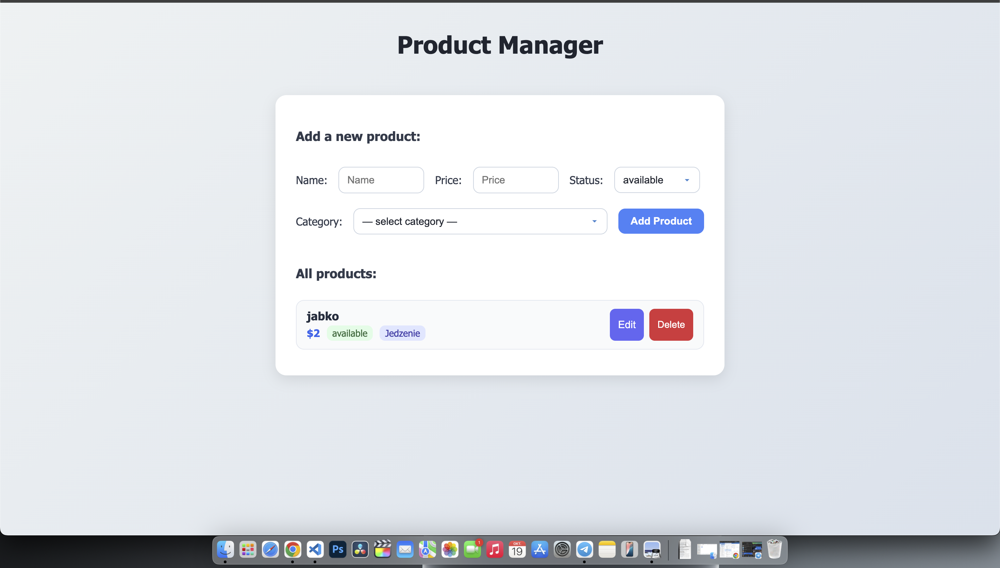

## Projekt Flask CRUD – Zarządzanie produktami

## Opis projektu

Aplikacja webowa stworzona w frameworku **Flask (Python)**, realizująca pełny system CRUD (*Create, Read, Update, Delete*) dla encji **Product**.
Projekt został wykonany w ramach zadania **Wymaganie A** i przedstawia kompletną integrację:

* **model bazy danych**,
* **API REST**,
* **frontend (HTML, CSS, JS)**.

Użytkownik może dodawać, edytować, usuwać oraz przeglądać produkty, które należą do określonych kategorii.

---

## Funkcjonalności

Dodawanie nowych produktów
Edycja i usuwanie istniejących produktów
Walidacja danych (np. poprawność nazwy, ceny, kategorii)
API REST dla wszystkich encji
Responsywny interfejs użytkownika (HTML + CSS + JavaScript)
Automatyczne tworzenie domyślnych kategorii przy starcie aplikacji

## Struktura projektu
```
Project_CRUD/
│
├── app.py               # główny plik Flask z trasami i API
├── models.py            # definicje modeli SQLAlchemy
│
├── templates/           # pliki HTML (frontend)
│   └── index.html
│
├── static/              # pliki statyczne
│   ├── style.css
│   └── script.js
│
├── instance/
│   └── products.db      # lokalna baza danych SQLite
│
├── README.md
└── requirements.txt
```
## Technologie

* **Python 3.11+**
* **Flask**
* **Flask-SQLAlchemy**
* **Flask-Migrate**
* **Flask-CORS**
* **SQLite**
* **HTML, CSS, JavaScript**

## Model danych (encje)

### Category

| Pole        | Typ     | Opis            |
| ----------- | ------- | --------------- |
| id          | Integer | Klucz główny    |
| name        | String  | Nazwa kategorii |
| description | String  | Opis kategorii  |

### Product

| Pole        | Typ     | Opis                                   |
| ----------- | ------- | -------------------------------------- |
| id          | Integer | Klucz główny                           |
| name        | String  | Nazwa produktu                         |
| price       | Float   | Cena                                   |
| status      | String  | Status („available” lub „unavailable”) |
| category_id | Integer | Klucz obcy (Category)                  |

### Customer

| Pole  | Typ     | Opis                    |
| ----- | ------- | ----------------------- |
| id    | Integer | Klucz główny            |
| name  | String  | Imię i nazwisko klienta |
| email | String  | Adres e-mail klienta    |

### Order

| Pole        | Typ      | Opis            |
| ----------- | -------- | --------------- |
| id          | Integer  | Klucz główny    |
| product_id  | Integer  | Produkt         |
| customer_id | Integer  | Klient          |
| quantity    | Integer  | Ilość           |
| order_date  | DateTime | Data zamówienia |

## Endpointy API

## Produkty

| Metoda | Endpoint             | Opis                       |
| ------ | -------------------- | -------------------------- |
| GET    | `/api/products`      | Lista wszystkich produktów |
| GET    | `/api/products/<id>` | Szczegóły produktu         |
| POST   | `/api/products`      | Dodanie nowego produktu    |
| PUT    | `/api/products/<id>` | Aktualizacja produktu      |
| DELETE | `/api/products/<id>` | Usunięcie produktu         |

## Kategorie

| Metoda | Endpoint               | Opis                |
| ------ | ---------------------- | ------------------- |
| GET    | `/api/categories`      | Lista kategorii     |
| POST   | `/api/categories`      | Dodanie kategorii   |
| PUT    | `/api/categories/<id>` | Edycja kategorii    |
| DELETE | `/api/categories/<id>` | Usunięcie kategorii |

## Interfejs użytkownika (frontend)

Frontend został zrealizowany w technologii **HTML + CSS + JavaScript**.

* Strona główna (`index.html`) wyświetla listę produktów.
* Formularz umożliwia dodawanie nowych produktów.
* Skrypt `script.js` łączy się z API i aktualizuje dane dynamicznie.
* Styl graficzny w pliku `style.css` oparty na nowoczesnym wyglądzie (rounded cards, cienie, responsywność).

## Uruchomienie projektu lokalnie

## Klonuj repozytorium

```bash
git clone https://github.com/<twoje_uzytkownik>/Project_CRUD.git
cd Project_CRUD
```

## Utwórz środowisko wirtualne

```bash
python -m venv venv
source venv/bin/activate       # macOS / Linux
venv\Scripts\activate          # Windows
```

## Zainstaluj zależności

```bash
pip install -r requirements.txt
```

## Uruchom aplikację

```bash
flask run
```

Aplikacja będzie dostępna pod adresem:
**(http://127.0.0.1:5001/)**

## Zrzut ekranu



## nstrukcja dla prowadzącego

1. Uruchomić aplikację lokalnie (lub w labie).
2. Otworzyć stronę główną `/`.
3. Dodać nowy produkt, przypisać kategorię.
4. Sprawdzić operacje CRUD (edycja, usunięcie).
5. Endpointy API można testować w Postmanie.


Хочешь, я сразу сделаю тебе PDF-версию этого README (для загрузки или сдачи в Moodle)?
